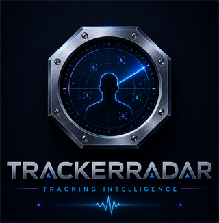

<p align="center">
  
</p>

# TrackerRadar

**Local-first Windows visibility for unexpected application behaviour.**

TrackerRadar shows which applications maintain external TCP connections, where they connect, which common startup entries change, and which applications access selected user-folder categories during a deliberately started short scan. It also provides two explicitly confirmed, reversible controls without a permanent privileged service.

## Status

**Version:** `0.5.3-alpha`

**State:** local visibility and safe-control prototype, not a complete security product

**Tested on:** Windows 11 Pro with Windows PowerShell 5.1

## Current capabilities

- Map active external TCP connections to processes
- Resolve domains from the local Windows DNS cache when available
- Explain common providers and purposes such as Microsoft, Apple, Anthropic, OpenAI, Google and cloud delivery services
- Establish a local baseline and highlight newly observed connections
- Detect new, changed or removed common startup entries
- Maintain a bounded local seven-day history without a database
- Provide Overview, Activities, Findings, History, File Access and Changes views
- Switch the complete interface locally between German and English
- Use a rounded dark-theme language selector matched to the primary button palette
- Fit the SC LABS and TrackerRadar marks cleanly into their rounded sidebar frames
- Remember the selected language in the local ignored `data/ui-settings.json` file
- Offer explicit links to the MalwareRadar and PrivacyRadar product pages; no website is contacted until the user clicks
- Run an explicitly started five-second file-access scan for Documents, Desktop, Downloads, OneDrive, Edge profiles and Chrome profiles
- Group file-access events by process, PID, folder category and observed operation
- Store no document contents and no individual file names in the access-scan result
- Delete temporary ETL and CSV trace files immediately after local summarization
- Block outbound internet access for a selected application through an explicit Windows Firewall rule
- Disable selected startup findings without deleting the original value or file
- Record approved control actions in a local Change Vault and undo supported changes
- Write local JSON reports under `data/`
- Operate without account, cloud backend or product telemetry

## Quick start

No installation is required for the alpha.

1. Download or clone the repository.
2. Double-click `Start-TrackerRadar.vbs` for a console-free start. `Start-TrackerRadar.cmd` is kept as a compatible fallback and delegates to the same hidden launcher.
3. Select **Deutsch** or **English** from the language selector in the upper-right corner.
4. Select **Jetzt prüfen / Scan now** for a network and startup snapshot.
5. Open **Dateizugriffe / File access** and start the five-second user-folder scan when needed.
6. Confirm the normal Windows UAC prompt when starting the file-access scan or a protected control action.

TrackerRadar does not elevate silently. The main interface runs without persistent administrator rights. The standard launcher hides only the PowerShell console; the TrackerRadar window remains visible and testable.

## What the file-access scan means

The current scan reliably associates Windows file-system events with a process and one of the monitored folder categories. It currently reports **Opened** and **Directory enumerated** style events. It does not claim that every event proves a file was read, copied or uploaded.

The scan is manual and short. It is not permanent monitoring and does not run on the 30-second network refresh timer.

## Test

```powershell
powershell.exe -NoProfile -ExecutionPolicy Bypass -File .\Test-TrackerRadar-App.ps1
```

The regression test covers:

- application core: 10 checks
- control helper: 9 checks
- control UAC wrapper: 3 checks
- file-access parser and privacy rules: 6 checks
- file-access UAC wrapper: 3 checks
- localization files, Unicode and persistence: 8 checks
- hidden launcher and visible-window verification: 7 checks
- bilingual UI, logo fit, product links and navigation: 27 checks
- WPF launch, GUI errors and memory usage

Machine-specific results are stored in the ignored `data/` directory.

The isolated firewall block/undo proof remains available in `Test-Firewall-BlockUndo.ps1`. It uses only a copied Windows `curl.exe` target. The real firewall effect remains an open public-release gate until both visible UAC prompts are completed and the absence of a residual rule is confirmed.

## Portable package

```powershell
powershell.exe -NoProfile -ExecutionPolicy Bypass -File .\Build-Portable.ps1
```

This creates an ignored `dist/` folder containing the portable ZIP and a matching SHA-256 file. The package is only created after all non-destructive build gates pass.

## Current limitations

- Network scans are momentary views of active external TCP connections, not packet capture.
- Domain names come from the local Windows DNS cache and are not always available.
- Provider and purpose labels are explanatory heuristics, not proof of ownership or intent.
- TrackerRadar does not decrypt HTTPS traffic.
- File-access monitoring is a manual five-second scan, not continuous monitoring.
- File-system event classification is intentionally limited to observed open and directory-enumeration events; exact read/write intent is not claimed.
- The file-access scan requires visible UAC approval because it starts a short Windows ETW trace session.
- Control is limited to selected outbound firewall rules and selected startup findings.
- TrackerRadar is not a replacement for antivirus, EDR or incident response.
- It cannot guarantee detection of every tracker, malware sample or backdoor.

## Privacy and security

See [PRIVACY.md](PRIVACY.md) and [SECURITY.md](SECURITY.md). Scan data and local development files are excluded from Git. The MalwareRadar and PrivacyRadar links open the external SC LABS website only after an explicit click; TrackerRadar does not preload those pages.

## Public release preparation

No GitHub remote is configured and no public push has been performed. See [PUBLIC-RELEASE-CHECKLIST.md](PUBLIC-RELEASE-CHECKLIST.md).

## Rights

Copyright 2026 SC LABS. All rights reserved. TrackerRadar is proprietary freeware, not open source. Permitted private, internal-business and evaluation use is defined in [LICENSE.md](LICENSE.md); branding and redistribution remain restricted. See also [NOTICE.md](NOTICE.md).

---

## Kurzbeschreibung auf Deutsch

TrackerRadar ist eine portable, lokale Windows-App im SC-LABS-Design. Sie zeigt aktive externe Verbindungen, erklärt bekannte Ziele, erkennt neue Aktivitäten gegenüber einer lokalen Baseline und führt einen begrenzten Sieben-Tage-Verlauf. Die vollständige Oberfläche kann lokal zwischen Deutsch und Englisch umgeschaltet werden; die Auswahl wird ausschließlich lokal gespeichert. Der Standardstart blendet das PowerShell-Konsolenfenster aus und zeigt nur die TrackerRadar-Oberfläche. Version 0.5 ergänzt einen bewusst gestarteten Fünf-Sekunden-Scan für ausgewählte Benutzerordner und Browserprofile. Angezeigt werden nur gebündelte Prozess-, Ordner- und Zugriffsinformationen; Dateiinhalte und einzelne Dateinamen werden nicht im Ergebnis gespeichert. Firewall- und Autostartaktionen bleiben bestätigungspflichtig und rückgängig machbar. Die Seitenleiste verlinkt MalwareRadar und PrivacyRadar erst nach einem bewussten Klick. TrackerRadar bleibt proprietäre Freeware; Weiterverteilung, Rebranding und kommerzielle Nutzung über die Lizenzrechte hinaus bleiben SC LABS vorbehalten.
